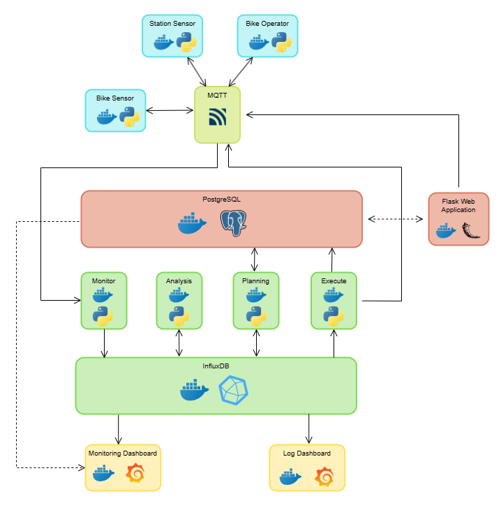
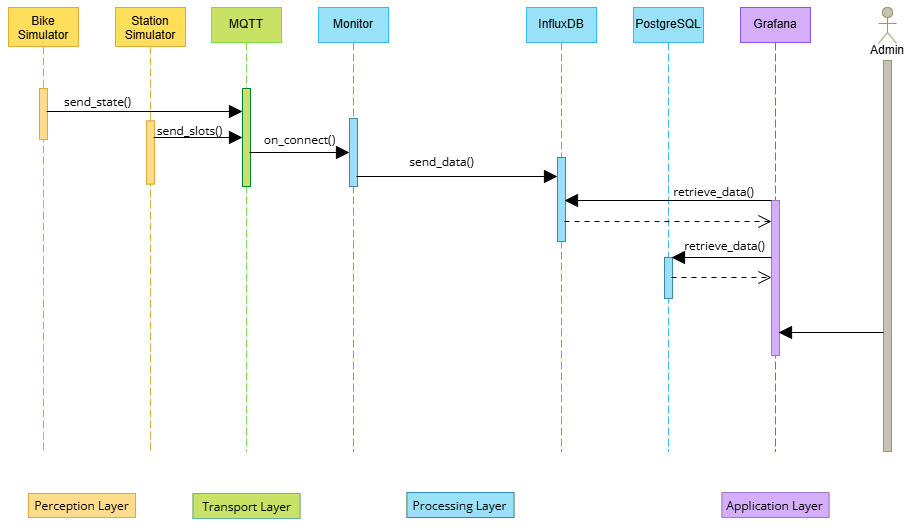
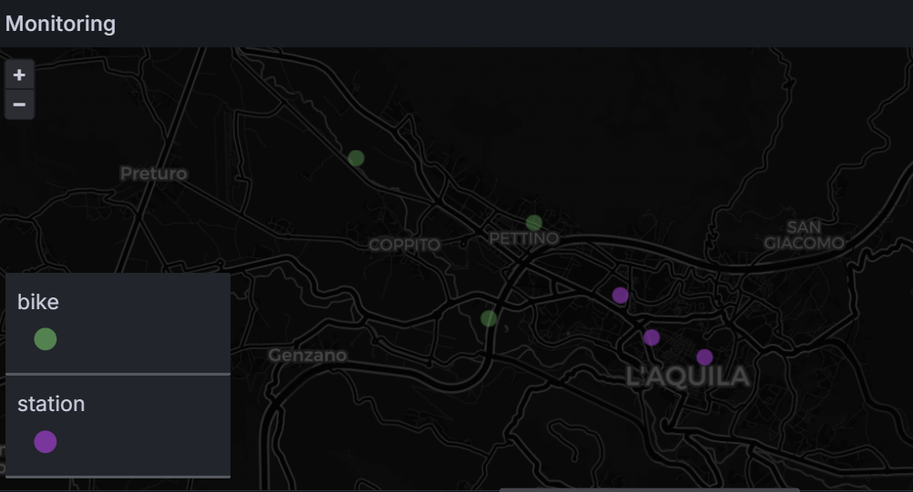
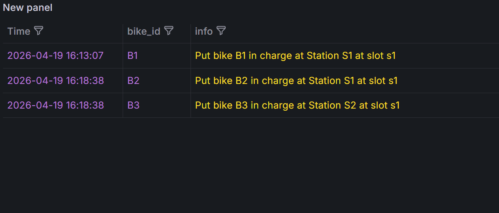
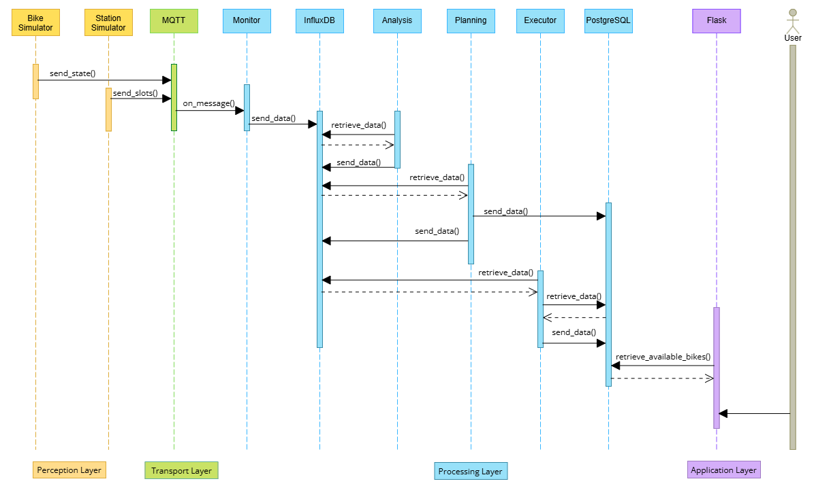
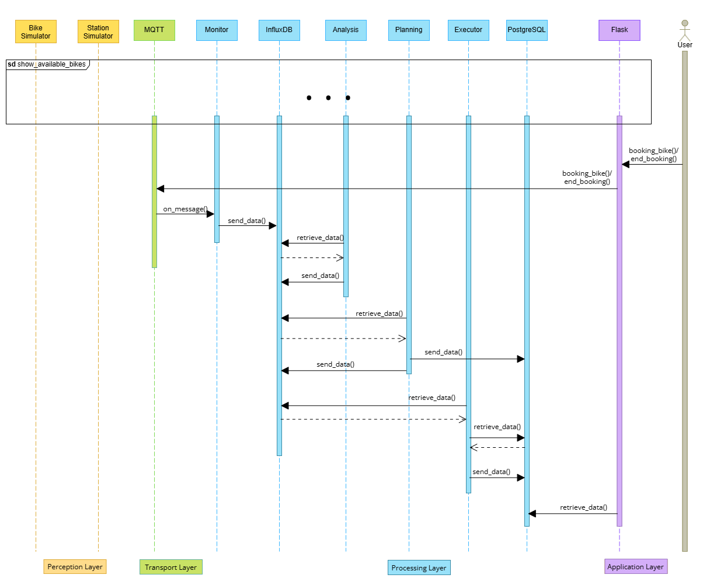
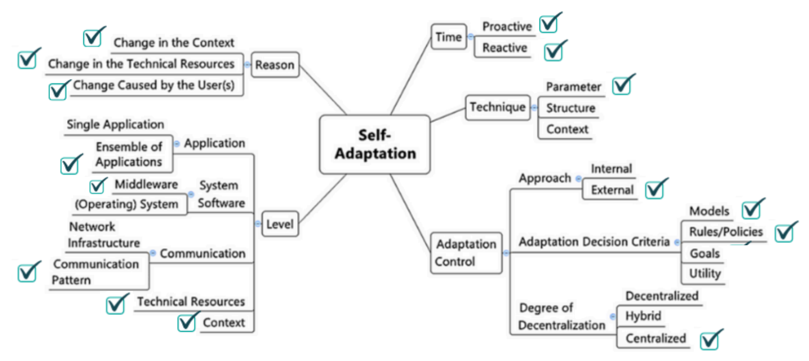
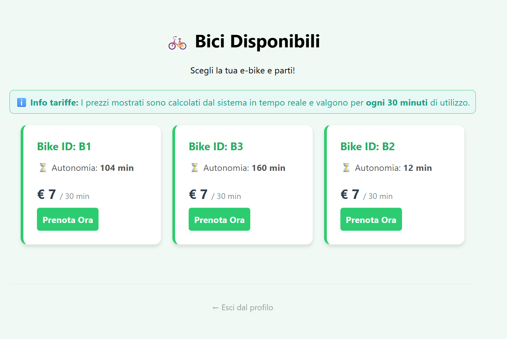

<script type="text/javascript" src="http://cdn.mathjax.org/mathjax/latest/MathJax.js?config=TeX-AMS-MML_HTMLorMML"></script>

# 🚲 **GreenMoving**

**Version:** 1.0  
**Last Update:** 18/04/2026

## 📖 **Project Description**
### **Introduction**
This project implements a Self-Adaptive Management System for an urban E-Bike sharing service, fully containerized via Docker. The system leverages the MAPE-K (Monitor-Analyze-Plan-Execute-Knowledge), InfluxDB, Grafana and a booking app created for bikes that use Flask and PostgreSQL.
By processing real-time telemetry, the system autonomously manages charging slot reservations, energy distribution rates, and dynamic pricing strategies to ensure high service availability and operational efficiency.

### Technical Stack
- Hardware values: Python-based edge device simulators
- Autonomous Engine: MAPE-K control loop.
- Communication: MQTT for low-latency messaging between sensors, actuators, and the MAPE-K components.
- Storage: InfluxDB (Time-series data for telemetry) and PostgreSQL (Relational data for users and bookings).
- Visualization: Grafana dashboards for admin real-time monitoring
- User Interface: Flask web application for customer reservations.



### **Managed Resources**
System monitors these resources to ensur operational integrity and availability

**Electric Bikes (E-Bikes)**
The Bikes are the primary mobile assets, each unit is managed as an edge device providing real-time telemetry.
**Sensors**
- Battery Sensor (BMS): Monitoring state-of-charge (SoC).
- GPS Module: Real-time tracking of latitude and longitude.
- Magnetic Proximity Sensor: Detecting connection to a station.
**Actuators**
- Motor Lock: Remote locking/unlocking based on booking status.
- Charging Controller: Component that receives electricity and charge bike.

**Charging Stations**
The Stations represent the fixed infrastructure and act as "hubs" for the bikes, each stations has the same number of slots defined by the system variable "n_slot_x_station" in the config.in file.
**Sensors**
- Occupancy Sensor: Real-time detection of bike presence in slots.
**Actuators**
- Charging Slot Actuator: Dynamically adjusts the charging power (rate) delivered to each bike.

All the managed resources are simulated, we created Digital Twin of bikes and station generating random value with a Python script.

### IoT Subsystem
The IoT subsystem acts as the "sensory layer" of the platform, facilitating continuous telemetry ingestion from both E-Bikes and Charging Stations. This component is responsible for monitoring hardware status, analyzing real-time data streams, and funneling processed information into InfluxDB for persistent storage and Grafana for visualization.

Through a dedicated Administrative Dashboard, system operators can access a real-time geospatial overview of the entire fleet. This allows for the immediate identification of bike distribution, station occupancy, and critical battery levels directly via interactive maps.

We use a Sequence Diagram for the illustration of the data flow across the Edge, Communication, Processing , and Application layers.



Also we provide some screenshot of Grafana dashboards used for fleet monitoring and checks of events
| Monitoring Dashboard | Event Dashboard |
| :---: | :---: |
|  | |

### Autonomous System
A self-adaptive platform governed by the MAPE-K framework, designed to orchestrate an E-Bike sharing ecosystem autonomously. By continuously monitoring environmental and telemetry data, the system performs self-optimization, adjusting dynamic pricing and station energy allocation in real-time to maintain operational efficiency and service availability without human oversight.

#### Bike Discovery Data Flow
This diagram illustrates the process of retrieving real-time bike telemetry and dynamically calculated prices from the database to the user interface, ensuring the dashboard reflects the current state of the fleet.


#### Bookings Sequence
This flow depicts the interaction between the user, the Flask application, and the autonomic system during a booking. It showcases how a reservation triggers the MQTT event logging and updates the system's knowledge base in PostgreSQL.



#### **Goals of the System**
This system aims to optimize an e-bike sharing ecosystem through real-time bikes monitoring, intelligent power distribution, stations rebalancing and dynamic pricing.

**Bikes Availability**
The system ensures that bikes remains operational and within authorized boundaries. It monitors telemetric data to trigger operator alerts under specific failure or risk conditions:
- **Geofencing Violation**
A bike is flagged if its coordinates fall outside the predefined operational polygon:  
$$\text{if } (lat < LAT_{min} \lor lat > LAT_{max}) \lor (lon < LON_{min} \lor lon > LON_{max})$$

- **Critical State of Charge**
Automated reporting for maintenance when the State of Charge ($SoC$) falls below the safety threshold:  
$$\text{if } SoC < SoC_{threshold} \land \neg \text{charging}$$

- **Availability**
The system autonomously determines the if a bike is categorized as "Available" and bookable for the user,  when it meets specific constrain defined by the following formal logic:
$$\text{Available} \iff (SoC > SoC_{threshold}) \land (\text{is\_locked}) \land (\neg \text{is\_booked})$$

**Stations Load Balancing**
To prevent "dead zones," the system maintains station occupancy within a functional buffer, ensuring that users can always find a bike to rent or an empty slot to return one. The occupancy $N_{occ}$ is constrained by the total capacity $C$:
$$1 \le N_{occ} \le (C - 1)$$
If a station state reaches Full ($N_{occ} = C$) or Empty ($N_{occ} = 0$), the planning module identifies the optimal "Source-Sink" pair and issues a Structural Balance task to the operator dashboard.

**Priority Charging**
To maximize the number of "User-Ready" bikes and minimize energy waste, the system implements a Priority Charging Strategy. Instead of uniform distribution, power $P_{tot}$ is allocated to favor the bike closest to a full charge, accelerating its availability.
The power assignment for the priority bike ($B_p$) and the remaining $n-1$ bikes ($B_{other}$) is defined as follows:
$$R_{s} = 
\begin{cases} 
\text{round} \left( \frac{P_{tot}}{(N_{high} \cdot 3) + (N_{low} \cdot 1)} \cdot 3 \right) & \text{if } \text{$B_p$} \\ 
\text{round} \left( \frac{P_{tot}}{(N_{high} \cdot 3) + (N_{low} \cdot 1)} \cdot 1 \right) & \text{if } \text{$B_{other}$} 
\end{cases}$$

The system implements self-adaptive logic to autonomously manage bikes dynamics and energy distribution. Below is the classification of our adaptive strategy:

**Dynamic Pricing**  
The system implements a *Self-Adaptive Dynamic Pricing* mechanism designed to optimize fleet utilization and revenue based on real-time environmental conditions and historical demand patterns.  
**1. Variables Definition**
- $P_{final}$: The calculated price for the current 30-minute block.
- $P_{base}$: The constant base price (set to $7.00€$).
- $\rho_{h}$: The historical demand ratio for the current hour $h$, calculated as the ratio of rentals at hour $h$ over the total historical rentals.
- $m_{h}$: The multiplier for historical demand.
- $m_{w}$: The multiplier for current weather conditions.

**2. Demand Multiplier ($m_{h}$)**  
The demand multiplier is a step function based on the historical density of bookings $\rho_{h}$:
$$m_{h} = \begin{cases} 
1.5 & \text{if } \rho_{h} > 0.10 \\ 
1.2 & \text{if } 0.05 < \rho_{h} \le 0.10 \\ 
1.0 & \text{if } \rho_{h} \le 0.05 
\end{cases}$$

**3. Weather Multiplier ($m_{w}$)**  
The multiplier $m_{w}$ is determined by the current weather state $W$:$$m_{w} = 
\begin{cases} 
1.2 & \text{if } W = \text{Clear} \\ 
1.0 & \text{if } W = \text{Clouds} \\ 
0.7 & \text{if } W = \text{Rain} \\ 
0.5 & \text{if } W = \text{Thunderstorm} 
\end{cases}$$

**4. Final Price Calculation**  
The system concludes the adaptation by computing the product of the base price and the active multipliers, rounding the result to two decimal places:$$P_{final} = \text{round}(P_{base} \cdot m_{h} \cdot m_{w}, 2)$$

### **Self-Adaptation**


**Time**  
The system operates on a dual temporal scale:
- *Proactive*: Continuous monitoring of bikes and station to prevent geofencing violations and maximize availability.
- *Reactive*: System reacts immediately when a user books a bike or end the booking.

**Technique**  
 The system evaluates real-time *parameters* (SoC, coordinates, occupancy, rate charging and prices) and adjustable thresholds to trigger corrective actions.

**Approach**  
The approach is *external*, as the adaptation logic is decoupled from the managed resources. The intelligence resides in the Analysis, Planning and Executor modules, which perceive the state of bikes and stations through the network.

**Adaptation Decision Criteria**  
The system combines two paradigms:
- *Objective-based*: If-then-else logic uses ($1 \le N_{occ} \le (C - 1)$).
- *Model-based*: For the dynamic princing we crate a statistical model of user's behaviour, on which system decisions are based.

**Degree of Centralization**  
Hybrid because while individual modules (Planning, Analysis, Executor) possess functional autonomy and local logic, they are coordinated through a centralized State Repository (InfluxDB) and orchestrated via Docker Compose.

**Reason**  
Triggering factors:
- *Change in the Context*: The weather is an external indipendent variable.
- *Change in Technical Resource*: Natural decreasing of battery levels (SoC) during operation.
- *Change Caused by the User*: Operational changes introduced by the operator and user that books bikes.

**Application**:  
The system is composed of an *ensemble of independent microservices* (containers) that interact asynchronously.

**System Software**   
The software is a *Middleware* and acts as an abstraction layer between the physical/simulated infrastructure (sensors/actuators) and the high-level decision-making logic.

**Communication**  
System relies on specific *communication patterns*:
- *MQTT*: For low-latency, asynchronous message brokering between edge resources and the monitor.
- *InfluxDB*: For time-series data persistence and historical state analysis.

**Context & Technical Resources**   
The system monitors both the *context* (weather) and the *technical resources* (level of battery)

<div style="page-break-after: always;"></div>

### **System Architecture**

#### **MQTT**
The system interacts with the environment using the MQTT protocol,.
- *Bike Sensor*: Act as sensors (telemetry) and actuators (locking/availability).
  - `ebike/bikes/+/telemetry`
  - `ebike/bikes/+/commands`
- *Station Sensor*: Manage physical charging and energy flow.
  - `ebike/stations/+/slots`
  - `ebike/stations/+/request`
- *Bike Operator*: A specialized simulated agent that performs physical tasks (moving bikes, manual charging) to simulate system dynamics.
  - `ebike/operators/events`
- *User*: User can book bikes via the Flask Web Application that speak directly with the Monitor through topic:
  - `ebike/bookings/received`

#### InfluxDB
A Time-Series Database (TSDB) optimized for storing and querying real-time telemetry, it serves as the primary repository for high-frequency IoT data from E-Bikes and stations.

##### **Monitor**
The Monitor module acts as a bridge between the MQTT broker and the Time-Series Database (InfluxDB). It subscribes to telemetry and slot topics, persisting raw data into two primary measurements:

`bikes`
| bike_id | battery | motor_locked | is_charging | lat | lon |
|--------|-------|------|------|------|------|------|
| B1 | 89 | True | False | 42.3455 | 13.3554 |

`station`
| station_id | slot1 | slot1_rate | slot2 | slot2_rate | slot3 | slot3_rate | slot4 | slot4_rate| slot5 | slot5_rate | 
|--------|-------|------|------|------|------|------|-------|------|------|------|
| S1 | B1 | 20 | empty | 0 | empty | 0 | empty | 0 | empty | 0 |

`bookings`
| bike_id | user_id | event | price | 
|--------|-------|------|------|
| B1 | U1 | BOOKED | 7.0 |

##### **Analysis**
The Analysis module queries the raw data and applies threshold-based logic to detect critical states, generating Events that require adaptation:

`station_analysis`:
Monitors station occupancy
| station_id | event |
|--------|-------|
| S1 | FULL |


`bike_analysis`:  Identifies bikes events.
| bike_id | event |
|--------|-------|
| B1 | LOW_BATTERY |


##### **Planning**
The Planning module retrieves active events and calculates the optimal corrective actions using the system's optimization rules:

`plan_bikes_recharging`: Identifies the optimal available slot for a low-battery bike and creates a reservation.
| bike_id | station_id | slot |
|------|------|------|
| B1 | S1 | slot3 |

`plan_station_rate`: Calculating the precise charging rate for each docked bike.
| station_id | slot | rate |
|------|------|------|
| S1 | slot2 | 10 |

`plan_bike` Identifies if a bike is available, booked or has ended the reservation.
| bike_id | event |station | slot | user_id | 
|--------|-------|--------|-------|
| B1 | BOOKED | S1 | s1 | 1 |

<div style="page-break-after: always;"></div>

#### PostgreSQL
PostgreSQL manages static structured data, including user profiles, bike registration, and the permanent log of bookings used to feed the dynamic pricing model.

`users` Saves users profiles information
| id | username | password |
|--------|-------|-------|
| 1 | marylu | sha256:marylu |

`available_bikes` Saves all real-time available bikes for showing them in the Web Application
| id | minutes | price |
|--------|-------|-------|
| B1 | 120 | 7.00 |

`stations_locations` Stores static information about stations locations.
| station_id | lat_s | lon_s | address | total_power |
|--------|-------|-------|--------|-------|
| S1 | 42.3540 | 13.3910 | Piazza Duomo | 20 |

`rides` Stores booking history of bikes and it is used for the dynamica price calculation.
| id | user_id | bike_id | start_time | end_time | status | price |
|--------|-------|-------|--------|-------|-------|-------|
| 1 | 1 | B1 | - | - | 'active' | 7.00 |


## 🚀 **Installation**

### **Prerequisites**
- Windows 10/11 
- Docker Desktop 4.58.0
- Python 3.13.9 (for local development and testing only)


### 🏗 **Project Structure**
```
📂 nome_progetto
┣ 📂 src/        # source code
┣ 📂 docs/       # documentation
┣ 📄 README.md   # principal documentation
```

### **Installation Steps**
1. Clone the repo
```sh
git clone https://github.com/m4rylu/GreenMoving
cd GreenMoving/src
```

2. Build and launch the system
```sh
docker-compose up --build -d
```

3. Navigate to http://localhost:3000/ where you will have access to all dashboards

4. Select one of them for retrieving information about monitoring, availability and events.

5. Navigate to http://localhost:5000/ where you will access to the Flask Web Application for booking bikes.


